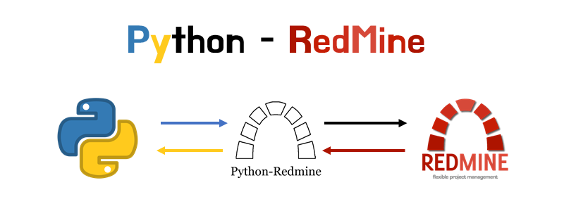
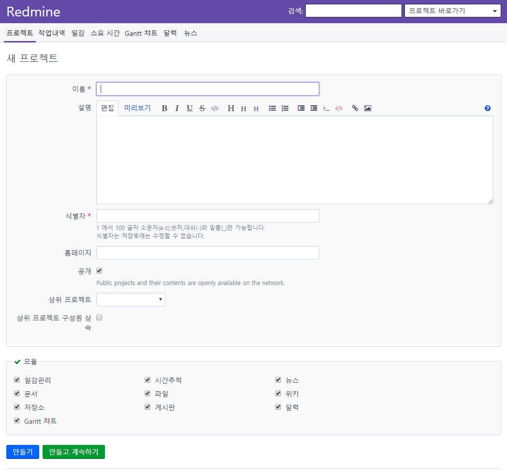
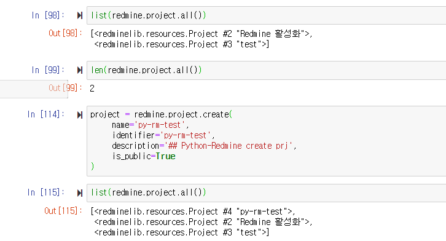
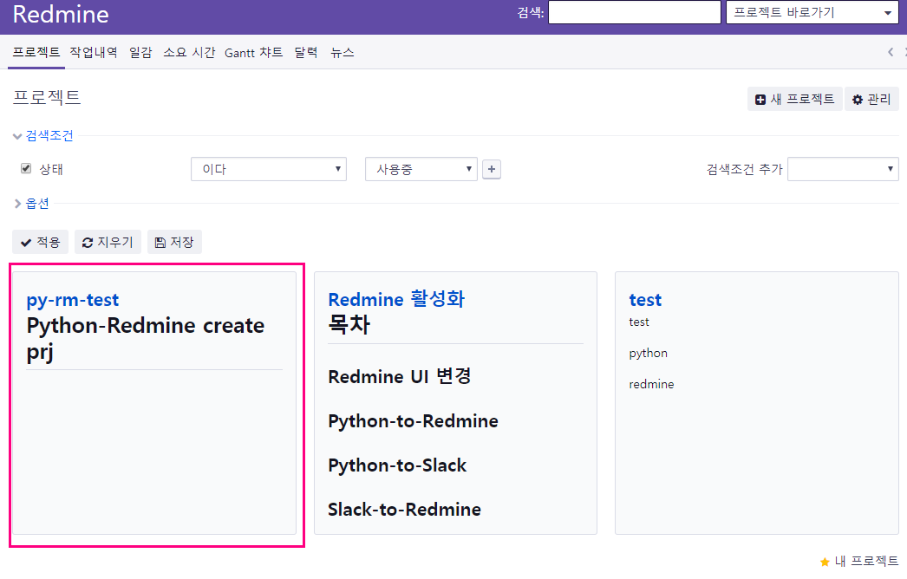
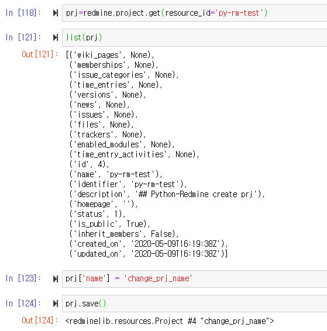
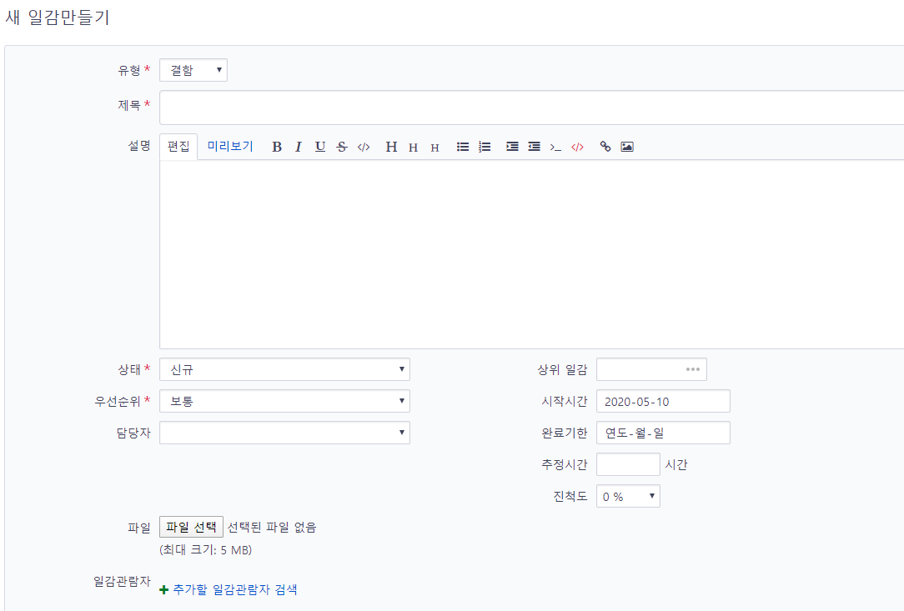
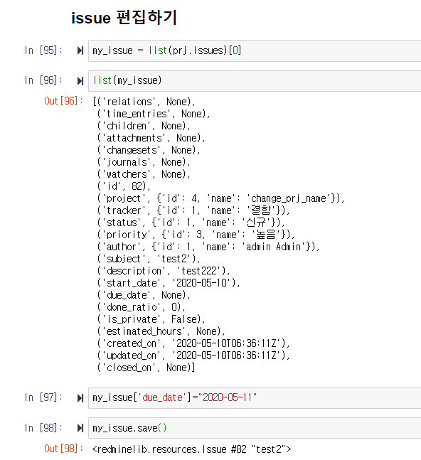

# Python-Redmine 연동하기

## 목차

- [Library 설치(python-redmine)](#Library-설치python-redmine)
- [Search, Resource, Introspection](#search-resource-introspection)
- [Redmine Project 불러오기](#redmine-project-불러오기)
- [Redmine Project 생성하기](#redmine-project-생성하기)
- [Redmine Project 편집하기](#redmine-project-편집하기)
- [Redmine 특정 Project Issue 불러오기](#redmine-특정-project-issue-불러오기)
- [Redmine 특정 Project Issue 생성하기](#redmine-특정-project-issue-생성하기)
- [Redmine 특정 Project Issue 편집하기](#redmine-특정-project-issue-편집하기)
- [Redmine 특정 Project Gantt-chart 다운로드하기](#redmine-특정-project-gantt-chart-다운로드하기)


## Library 설치(python-redmine)

```bash
pip install python-redmine
```

## Search, Resource, Introspection

시작에 앞서 3가지 요소에 대해서 알고 있을 필요가 있습니다.   

### Search

아래 내용은 [Search](https://python-redmine.com/introduction.html#search)에 있는 내용을 일부만 번역한 것입니다. 자세한 내용은 직접 방문해서 확인하시기 바랍니다.

Redmine 3.3 이후 버전부터 Search API를 활용한 검색이 가능해졌습니다.  
Python-Redmine에서는 2가지 방식으로 search를 사용할수 있는데,  
첫번째 방식은 ResourceManager object의 ``` search() ``` method을 사용하는 것이고  
두번째 방식은 configured redmine object의 ``` search() ``` method를 사용하는 것입니다.  
  
예시는 아래와 같습니다. 

```python
# Resource manager의 serch 기능 사용하기
>>> issue = redmine.issue.search('rom')
<redmine.resultsets.ResourceSet object with Issue resources>
```

```python
# configure redmine의 serch 기능 사용하기
>>> resources = redmine.search('rom')
{'news': <redminelib.resultsets.ResourceSet object with News resources>,
 'issues': <redminelib.resultsets.ResourceSet object with Issue resources>}
```

1번 방법과 2번방법을 보면 1번 방법은 뭔가 명확하게 불러온 obj에서 search를 사용한다는 말이라고 생각하면 편하고

2번 방법은 그냥 redmine의 search console에 입력한 결과를 받아보는 것이라고 생각하면 편합니다.  

두가지 방법 모두 아래 옵션들과 함꼐 사용하는것이 가능합니다.

- **titles_only** : *True*로 설정하면 다른건 무시하고 title만 가져옵니다.  
- **open_issues** : *True*로 설정하면 open issue만 가져옵니다.  
- **attachments** : *True* 로 설정하면 attachments만 가져옵니다.
- **scope**       : my_projects to search only in user’s projects.  
- **resources**   : search() method를 적용할때 원하는 항목만 골라서 가져올 수 있습니다. 가져올 수 있는 항목의 종류는 다음과 같습니다. issues, news, documents, changesets, wiki_pages, messages, projects and more if additional plugins that support this API are installed.


---

### [Resource](https://python-redmine.com/introduction.html#resource)

Resource object는 Python-Redmine Library에서 아주 중요한 부분입니다.  
모든 object는 각자가 단일 resource로 표현되고 다양한 방법으로 접근 가능합니다.  

Python-redmine에서 거의 모든 object가 Resource로 이뤄진다고 생각하면 편합니다.
예를들어 전체 project 목록과 개수를 가져오고 싶다면 아래와 같이 하면 됩니다.

```python
redmine = Redmine(redmine_url, username="your_id", password="your_pw")
print(list(redmine.project.all()))
print(len(redmine.prject.all()))
```

---

### Introspection

다른 Resource들은 다른 특성들을 지닐수 있습니다. 심지어 같은 type일지라도 말이죠.  
특성은 Redmine으로부터 데이터를 받아 올때 Python-Redmine에 의해서 동적으로 구축됩니다.
이 말은 우리가 Redmine으로부터 받아온 Resource를 쓰기전에 내부를 확인해야 한다는 뜻입니다.  

운이 좋게도 Resource 객체의 내부를 확인할 수 있는 몇가지 방법이 있습니다.

dir, list, repr 등을 사용하면 되는데 

여기에는 dir과 list 방식만 적겠습니다.


```python
>>> dir(redmine.project.get('vacation'))
['created_on',
 'description',
 'enabled_modules',
 'id',
 'identifier',
 'issue_categories',
 'issues',
 'memberships',
 'name',
 'news',
 'status',
 'time_entries',
 'trackers',
 'updated_on',
 'versions',
 'wiki_pages']
```

```python
>>> list(redmine.project.get('vacation'))
[('created_on', '2015-11-23T08:18:39Z'),
 ('time_entries', None),
 ('trackers', None),
 ('wiki_pages', None),
 ('status', 1),
 ('description', 'foo'),
 ('news', None),
 ('versions', None),
 ('identifier', 'vacation'),
 ('name', 'Vacation'),
 ('enabled_modules', None),
 ('issues', None),
 ('issue_categories', None),
 ('memberships', None),
 ('id', 123),
 ('updated_on', '2015-11-23T08:20:31Z')]
```

---

## Redmine Project 불러오기

---

Python-Redmine library를 이용해서 Redmine에 있는 project list를 불러온다.

```python
from redminelib import Redmine
import requests

redmine_url = "your_redmine_url"
redmine = Redmine(redmine_url, username="your_id", password="your_pw")

print(list(redmine.project.all())) # list of project
print(len(redmine.project.all())) #number of project
```

전체 프로젝트 내역을 atom, json, xml 형식으로 저장 할 수도 있는데 방식은 아래와 같습니다.

```python
#현위치에 projects.atom 이라는 이름으로 project 정보를 저장
projects = redmine.project.all()
projects.export('atom',savepath='./',filename='projects.atom')

```

```python
#현위치에 projects.json 이라는 이름으로 project 정보를 저장
projects = redmine.project.all()
projects.export('json',savepath='./',filename='projects.json')
```


```python
#현위치에 projects.xml 이라는 이름으로 project 정보를 저장
projects = redmine.project.all()
projects.export('xml',savepath='./',filename='projects.xml')
```

개인적으로는 atom 보다는 json이나 xml을 사용하시는 것이 좋을 것 같은데 그 중에서도 json이 더 좋을 것 같습니다.  

보기도 편하고 나중에 python에서 dictionary로 읽어오거나 전달하기 편하기 때문입니다.


## Redmine Project 생성하기

---

이번에는 프로젝트를 생성해보겠습니다.  

실제로 Redmine에서 project 생성하는 화면은 아래와 같습니다.

  

---
  
  
Python에서 project를 생성하는 경우에도 위 사진에 있는 내용들이 전달되어야 합니다.

따라서 전달해야 하는 목록은 아래와 같습니다. 

### Parameters:	  
- **name** (string) – (required). Project 이름.  
- **identifier** (string) – (required). Project 식별자.  
- **description** (string) – (optional). Project 설명.  
- **homepage** (string) – (optional). Project homepage url.  
- **is_public** (bool) – (optional). 공개여부 *True*면 공개.  
- **parent_id** (int) – (optional). 부모 project의 id.
- **inherit_members** (bool) – (optional). 부모 project의 멤버 포함 여부 *True*면 포함.  
- **tracker_ids** (list) – (optional). The ids of trackers for this project.  
- **issue_custom_field_ids** (list) – (optional). The ids of issue custom fields for this project.  
- **custom_fields (list)** – (optional). Custom fields as [{‘id’: 1, ‘value’: ‘foo’}].  
- **enabled_module_names** (list) – (optional). 이 Project에서 사용할 module의 이름을 넣으면 됩니다. (Redmine >= 2.6.0 only).  

```python
>>> project = redmine.project.create(
...     name='Vacation',
...     identifier='vacation',
...     description='foo',
...     homepage='http://foo.bar',
...     is_public=True,
...     parent_id=345,
...     inherit_members=True,
...     tracker_ids=[1, 2],
...     issue_custom_field_ids=[1, 2],
...     custom_fields=[{'id': 1, 'value': 'foo'}, {'id': 2, 'value': 'bar'}],
...     enabled_module_names=['calendar', 'documents', 'files', 'gantt']
... )
>>> project
<redminelib.resources.Project #123 "Vacation">
```

위 내용은 예시 코드인데 실제로 수행하면 아래와 같습니다.

```python
project = redmine.project.create(
     name='py-rm-test',
     identifier='py-rm-test',
     description='## Python-Redmine create prj',
     is_public=True
)
```


---



---

## Redmine Project 편집하기

Redmine Project를 편집하려면 불러와야 합니다.  
불러오는 방법은 다양한데 잘 불러왔다고 치고 진행해 보겠습니다.  
방금 생성한 py-rm-test를 수정해보겠습니다.

```python
prj = redmine.project.get(resource_id='py-rm-test')
print(prj['name'])
prj['name'] = 'change_prj_name'
prj.save() # save를 꼭 해야합니다.
```


수정한 후에 꼭 save까지 해주셔야 합니다.


## Redmine 특정 Project Issue 불러오기

이하 내용은 [issue](https://python-redmine.com/resources/issue.html)에 있는 내용을 번역 및 참고하여 작성되었습니다.


특정 프로젝트가 가지고 있는 issue를 불러오는 방법은 간단합니다.

```python
prj = redmine.project.get(resource_id="your_project_id")
my_prj_issue_list = list(prj.issues)
```

위와 같이 수행하면 ```my_prj_issue_list```에 내가 선택한 프로젝트의 issues list가 담깁니다.


## Redmine 특정 Project Issue 생성하기


Redmine에서 project의 issue를 생성하는 방법도 크게 다르지 않습니다.  
대신 채워야 하는 parameter 종류가 조금 많습니다.  
그래도 대부분 optional이기 때문에 필요한것만 채워서 생성하는것도 가능합니다.  

어떤 것이 필수(required)이고 어떤 것이 선택사항(optional)인지 아래 parameter에서 확인해보세요.

Parameters:  
- **project_id** (int or string) – (**required**). issue가 추가 될 project의 id 나 식별자 .  
- **subject** (string) – (**required**). Issue 제목.  
- **tracker_id** (int) – (optional). Issue tracker id.  
- **description** (string) – (optional). Issue 설명.  
- **status_id** (int) – (optional). Issue status id.  
- **priority_id** (int) – (optional). Issue priority id.  
- **category_id** (int) – (optional). Issue category id.  
- **fixed_version_id** (int) – (optional). Issue version id.  
- **is_private** (bool) – (optional). Whether issue is private.  
- **assigned_to_id** (int) – (optional). Issue will be assigned to this user id.  
- **watcher_user_ids** (list) – (optional). User ids watching this issue.  
- **parent_issue_id** (int) – (optional). Parent issue id.  
- **start_date** (string or date object) – (optional). Issue start date.  
- **due_date** (string or date object) – (optional). Issue end date.  
- **estimated_hours** (int) – (optional). Issue 추정시간.  
- **done_ratio** (int) – (optional). Issue 완료 비율.    
- **custom_fields** (list) – (optional). Custom fields as [{‘id’: 1, ‘value’: ‘foo’}].  
- **uploads** (list) – (optional). Uploads as [{'': ''}, ...], accepted keys are:  
   - path (**required**). Absolute file path or file-like object that should be uploaded.
   - filename (optional). Name of the file after upload.
   - description (optional). Description of the file.
   - content_type (optional). Content type of the file.

확인하시기 편하도록 실제 issues 생성화면을 첨부하오니 필요하신 내용을 확인하고 채우시기 바랍니다. 



- 유형 = tracker_id  
- 제목 = subject
- 설명 = description
- 상태 = status_id
- 우선순위 = priority_id
- 담당자 = assigned_to_id
- 상위일감 = parent_issue_id
- 시작시간 = start_date
- 완료기한 = due_date
- 추정시간 = estimated_hours
- 진척도 = done_ratio
- 파일 = uploads

```python
new_issue = redmine.issue.create(
    project_id = list(redmine.project.all())[0]['id'],
    subject="my_issue", # 제목
    tracker_id=2, #유형 {결함 : 1, 새기능 : 2, 지원 : 3}
    description="description of issue",
    status_id = 0, # 초기생성에서는 신규 밖에 선택이 안됨
    priority_id =2, # 우선순위 {낮음 : 1, 보통 : 2, 높음 : 3, 긴급 : 4}
    category_id=0,  # 뭔지 모르겠음
    start_date = "2020-05-10",
    due_date = "2020-05-12",
    done_ratio = 50
)
```


## Redmine 특정 Project Issue 편집하기

특정 project의 issue를 불러와서 편집해보겠습니다.

```python
my_issue = list(prj.issues)[0]
my_issue['due_date']="2020-05-11"
my_issue.save()
```




## Redmine 특정 Project Gantt-chart 다운로드하기

Gantt-chart를 다운로드 하는 방법은 아래와 같습니다.
아래와 같은 방식으로 받아야 private project도 다운받을 수 있습니다.

```python
filepath = redmine.download(
    url = list(redmine.project.all())[0]['url']+"/issues/gantt.pdf",
    savepath='./',
    filename="gantt.pdf"
    )
```

---